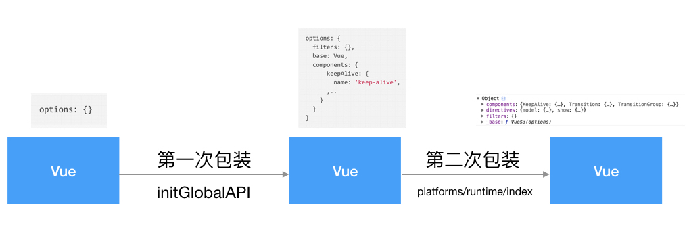
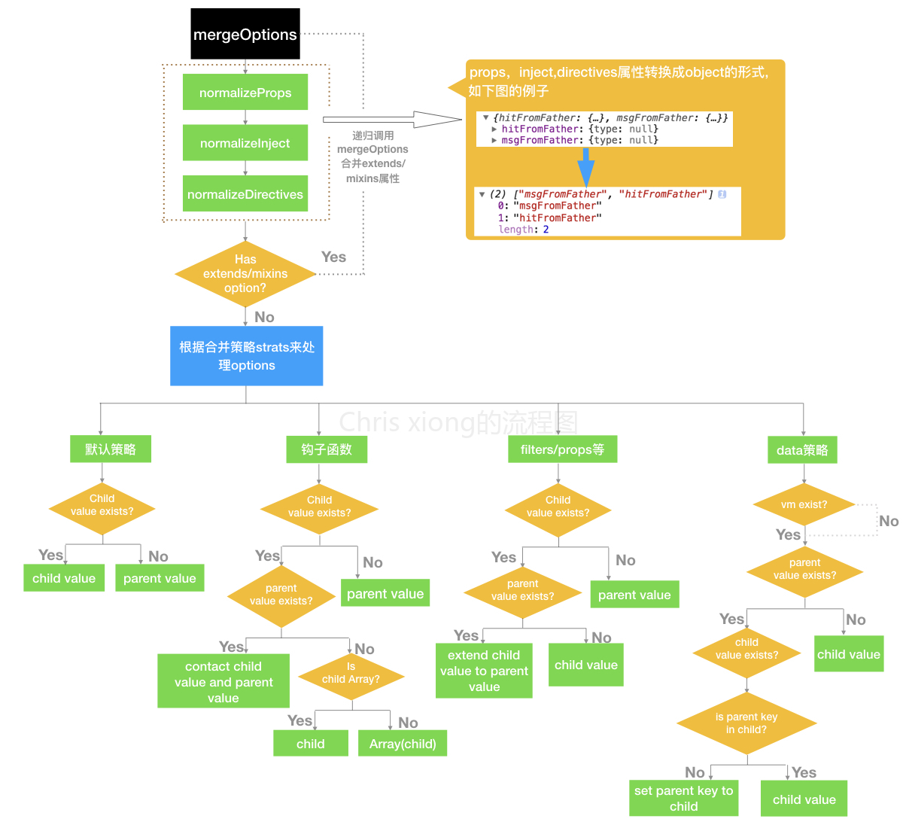

# 初始化

上一章节，我们找到了 Vue 的入口文件，从这章节我们就从入口文件，开始了解 Vue 的初始化，真正的开始 Vue 源码的学习。
在使用 Vue 的时候，我们一般都是这么用的：

```js
let v = new Vue({
    el: "#app",
    data: {
        a: 1,
        b: [1, 2, 3]
    }
});
```

开始学习源码，我们就要带着疑问学习。在上面我们 new 了一个 Vue 的实例，那么这个 Vue 的实例都做了些什么呢？我们就结合 Vue 的定义来看一下：

```js
...
function Vue(options) {
    // options = {
        // el:"#app",
        // data:{
            // a:1,
            // b:[1,2,3]
        // }
    // }
    if (process.env.NODE_ENV !== "production" && !(this instanceof Vue)) {
        warn(
            "Vue is a constructor and should be called with the `new` keyword"
        );
    }
    this._init(options);
}

export default Vue;
```

从上面可以看出来，Vue 是一个构造函数，这个构造函数调用了`_init()`方法，那么我们就看一下这个方法`src/core/instance/init.js`：

```js
export function initMixin(Vue: Class<Component>) {
    // options==={el:'#app,data:{a:1,b:[1,2,3]}}
    Vue.prototype._init = function(options?: Object) {
        const vm: Component = this;
        // a uid
        vm._uid = uid++;

        let startTag, endTag;
        /* istanbul ignore if */
        if (
            process.env.NODE_ENV !== "production" &&
            config.performance &&
            mark
        ) {
            startTag = `vue-perf-start:${vm._uid}`;
            endTag = `vue-perf-end:${vm._uid}`;
            mark(startTag);
        }

        // a flag to avoid this being observed
        vm._isVue = true;
        // merge options
        if (options && options._isComponent) {
            // optimize internal component instantiation 优化内部组件实例
            // since dynamic options merging is pretty slow, and none of the
            // internal component options needs special treatment.
            initInternalComponent(vm, options);
        } else {
            vm.$options = mergeOptions(
                resolveConstructorOptions(vm.constructor),
                options || {},
                vm
            );
        }
        /* istanbul ignore else */
        if (process.env.NODE_ENV !== "production") {
            initProxy(vm);
        } else {
            vm._renderProxy = vm;
        }
        // expose real self
        vm._self = vm;
        initLifecycle(vm); //初始化生命周期
        initEvents(vm); //初始化事件
        initRender(vm); //初始化渲染
        callHook(vm, "beforeCreate");
        initInjections(vm); // resolve injections before data/props
        initState(vm); //vm的状态初始化，prop/data/computed/method/watch都在这里完成初始化
        initProvide(vm); // resolve provide after data/props
        callHook(vm, "created");

        /* istanbul ignore if */
        if (
            process.env.NODE_ENV !== "production" &&
            config.performance &&
            mark
        ) {
            vm._name = formatComponentName(vm, false);
            mark(endTag);
            measure(`vue ${vm._name} init`, startTag, endTag);
        }

        if (vm.$options.el) {
            vm.$mount(vm.$options.el); //挂载元素
        }
    };
}
```

`_init()`这个方法就是首先定义了几个常量，然后调用`mergeOptions()` 对传入的参数`options`进行了  合并，最后就是初始化了生命周期、事件、渲染以及 data/prop/method 等 。这个时候还调用了 Vue 的钩子函数。最后调用`$mount`进行了元素的挂载。  
那我们就来看一下是如何合并 options 的,因为在`mergeOptions()`这个方法接收了`resolveConstructorOptions(vm.constructor)`这个方法的返回值，所有先看一下这个方法的返回值是什么`src/core/instance/init.js`:

```js
export function resolveConstructorOptions(Ctor: Class<Component>) {
    // 在调用的时候是resolveConstructorOptions(vm.constructor)
    // vm.constructor就是Vue的方法
    //Vue.options = {
    //   components: {},
    //   directives: {},
    //   filters: {},
    //   _base: Vue
    // }

    let options = Ctor.options;
    if (Ctor.super) {
        // 有super属性，说明Ctor是Vue.extend构建的子类
        const superOptions = resolveConstructorOptions(Ctor.super);
        // Vue构造函数上的options,如directives,filters,....
        const cachedSuperOptions = Ctor.superOptions;
        if (superOptions !== cachedSuperOptions) {
            // super option changed,
            // need to resolve new options.
            Ctor.superOptions = superOptions;
            // check if there are any late-modified/attached options (#4976)
            const modifiedOptions = resolveModifiedOptions(Ctor);
            // update base extend options
            if (modifiedOptions) {
                extend(Ctor.extendOptions, modifiedOptions);
            }
            options = Ctor.options = mergeOptions(
                superOptions,
                Ctor.extendOptions
            );
            if (options.name) {
                options.components[options.name] = Ctor;
            }
        }
    }
    // 如果Ctor是基础Vue构造器时，就如我们通过new关键字 new Vue实例的时候，
    // options就是Vue构造函数上的options
    return options;
}
```

在 `resolveConstructorOptions`方法中对传进来的参数进行了是否是 Vue 的基础构造器的判断。我们就先看一下如果是 Vue 基础构造器的时候，这个时候`Ctor.options`就是 Vue 构造函数上的 options。那么，Vue 构造函数上的 options 又是什么呢？到目前位置我们只分析了入口文件，和 Vue 定义之后只是调用了`_init()`方法，并没有看到 options 在哪里定义的，那么这个 options 到底是什么呢？  
大家是否还记得，我们在分析入口文件的时候，找到了`src/platforms/web/entry-runtime-with-compiler`这个文件，这个文件呢就是对 Vue 进行了第一层的包装，但是并没有 options 的相关内容，那么我们往上一级寻找，找到了`src/platforms/web/runtime/index.js`这个文件，这是对 Vue 的第二层包装，在这里可以看到有关 options 的内容：

```js
...
import Vue from "core/index"; //第三次包装
...
extend(Vue.options.directives, platformDirectives)
extend(Vue.options.components, platformComponents)
...
```

上面的代码主要是给 Vue.options 添加一些属性，并没有真正的定义。我们再次往上找,找到`src/core/global-api/index.js`:

```js
...
Vue.util = {
    warn,
    extend,
    mergeOptions,
    defineReactive
  };

  Vue.set = set;
  Vue.delete = del;
  Vue.nextTick = nextTick;

  Vue.options = Object.create(null);
  //ASSET_TYPES = [
  //   'component',
  //   'directive',
  //   'filter'
  // ]
  ASSET_TYPES.forEach(type => {
    Vue.options[type + "s"] = Object.create(null);
  });

  // this is used to identify the "base" constructor to extend all plain-object
  // components with in Weex's multi-instance scenarios.
  Vue.options._base = Vue;

  extend(Vue.options.components, builtInComponents);

  ...
}
```

至此我们发现 Vue 构造函数上的 options 就是

```js
Vue.options = {
    components: {},
    directives: {},
    filters: {},
    _base: Vue
};
```

如图



因此当 `resolveConstructorOptions()`方法就是在 Ctor.super 不存在时，返回了 Vue 构造函数的 otpions（Ctor.super 是通过 Vue.extend 构造子类的时候，Vue.extend 会为 Ctor 添加一个 super 属性，指向其父类构造器，这种情况比较复杂，先不讨论）。
我们再回来看一下`vm.$options = mergeOptions( resolveConstructorOptions(vm.constructor), options || {}, vm );`此时就可以替换成`vm.$options = mergeOptions( vm.options, options || {}, vm );`,那么我们再来看一下`mergeOptions()`(`src/core/util/options.js`):

```js
/**
 * Merge two option objects into a new one.
 * Core utility used in both instantiation and inheritance.
 */
export function mergeOptions(
    parent: Object,
    child: Object,
    vm?: Component
): Object {
    // 传入的三个参数分别代表：
    // 1、Vue实例构造函数上的options
    // 2、实例化是我们自己传入的参数
    // 3、vm实例本身
    // 也就是这个方法就是合并parent和child
    //parent = {
    //   components: {},
    //   directives: {},
    //   filters: {},
    //   _base: Vue
    // }
    // child===={el:'#app,data:{a:1,b:[1,2,3]}}
    if (process.env.NODE_ENV !== "production") {
        checkComponents(child); //检查组件名称是否合法
    }

    if (typeof child === "function") {
        child = child.options; //如果child是function类型的话，我们取options属性作为child
    }

    normalizeProps(child, vm); //把props属性转换成对象的形式
    normalizeInject(child, vm); //把inject属性转换成对象的形式
    normalizeDirectives(child); //把directives属性转换成对象的形式

    const extendsFrom = child.extends;
    if (extendsFrom) {
        // 当传入的options里有extends时，再次调用mergeOptions方法进行合并
        parent = mergeOptions(parent, extendsFrom, vm);
    }
    if (child.mixins) {
        // 当传入的options里有mixin时，再次调用mergeOptions方法进行合并
        //
        for (let i = 0, l = child.mixins.length; i < l; i++) {
            parent = mergeOptions(parent, child.mixins[i], vm);
        }
    }
    const options = {};
    let key;
    for (key in parent) {
        mergeField(key);
    }
    for (key in child) {
        if (!hasOwn(parent, key)) {
            mergeField(key);
        }
    }
    function mergeField(key) {
        //const defaultStrat = function(parentVal: any, childVal: any): any {
        //   return childVal === undefined ? parentVal : childVal;
        // };
        // defaultStrat的逻辑就是，如果child上该属性值存在，就取child上的，如果不存在，就取parent上的

        //const strats = config.optionMergeStrategies;
        const strat = strats[key] || defaultStrat;
        options[key] = strat(parent[key], child[key], vm, key);
    }
    return options;
}
```

我们先翻译一下`mergeOptions()`最开始的两行注释，就是：`将两个options对象合并生成一个新的options`。这个就是实例化和继承中使用的核心方法。
我们把`mergeOptions()`中的方法都放在了代码注释中，可以仔细看一下，有些内容还是没有细讲，以后会有专门的文章进行讲解。最后返回了合并后的 options。
借用[淼淼真人](https://www.imooc.com/u/6702342/articles)的图来最后总结一下`mergeOptions()`：


# 总结

Vue 的初始化文件`init.js`就是将 options 进行了合并，最后对生命周期、事件等进行了初始化，然后把这些进行了挂载。
