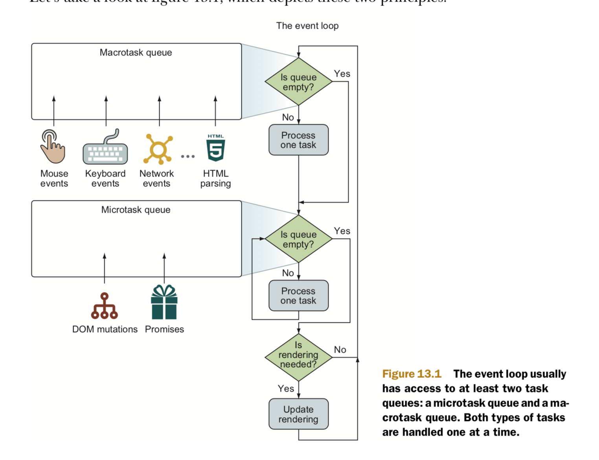

# Vue 的 NextTick

## 初看 Event loop

对于初学者来说 只需要理解 Javascript 是单线程的。运行环境中包含一个队列和执行栈。代码中同步任务都在执行栈中执行，遇到一些需要异步操作比如 setTimeout 或者 ajax 请求。运行环境底层会开启线程来执行，执行完成后将回调函数放到异步队列里 。队列里放的都是异步任务的回调函数。在执行栈中没有任务执行的时候，则会从队列中取一个任务（回调函数），放到当前执行栈中来执行。如此反复 就是 Event Loop。那么来看看下面一段代码的执行结果。

```javascript
console.log("script start");

setTimeout(function() {
  console.log("setTimeout");
}, 0);

Promise.resolve()
  .then(function() {
    console.log("promise1");
  })
  .then(function() {
    console.log("promise2");
  });

console.log("script end");
```

执行结果是

```javascript
script start
script end
promise1
promise2
setTimeout
```

如果不明白为什么，那么你需要深入理解 event loop 了。

## 细看 Event Loop


实际上在整个循环中有两个任务队列，分别叫做 macrotasks（宏任务，经常也叫 tasks） 和 microtasks（微任务）. 在每次 loop 的时候，需要从队列中选一个头部的等待时间最长的的宏任务来执行，在执行完宏任务，然后查看如果微任务队列，如果微任务队列中有任务，则不断循环将微任务队列里的任务全都执行完。然后再判断浏览器是否要执行 UI 渲染。具体的 event loop 过程可以  参照[HTML5 whatwg 规范](https://html.spec.whatwg.org/multipage/webappapis.html#event-loop-processing-model).

需要注意的是执行 JavaScript Code 也是一个 macrotask. 可以参考一个代码的执行例子来理解。[Task,Macrotask](https://jakearchibald.com/2015/tasks-microtasks-queues-and-schedules/)

### UI 渲染

浏览器尝试一秒渲染 60 次页面，也就是说 1 秒 60 帧（60fps）。这个频率下，动画就感觉比较平滑。这意味着如果你的应用要体验好的话，那么每次循环中的 macrotask,和这次循环中所有的 microtasks 执行的事件不能超过 16ms.

- 在距离上次渲染 16ms 之前， event loop 达到是否渲染检查点，如果没有显势的需要来渲染页面，浏览器就不会这本次循环中渲染页面
- 距离上次渲染 16ms 之后，达到是否渲染的检查点，这种情况下浏览器就会重新渲染页面
- 执行一个任务超过了 16ms，那么在这个执行时间之内浏览器就不会渲染页面。动画就会变卡，最坏的情况下，浏览器就没有响应。

### macrotasks

macrotasks 包含 创建 DOM，解析 HTML，执行 JavaScriptCode，各种事件（Page Loading），输入事件，网络事件，timer 事件，在执行完这些事件后，浏览器通常需要 重绘（re-render）UI。或者执行垃圾回收。

### microtasks

microtasks 指的是微小的任务，也是异步的  任务，每次执行的时候需要在重绘 UI 之前执行。比如 Promise.then， Dom 的修改 MutationObsever。这些任务也需要异步执行，但是需要立即执行，没有 macrotask 那么耗时。

## nextTick

vue 中 修改了一个数据，nextTick 官方解释是在下次 DOM 更新循环结束之后执行延迟回调。在修改数据之后立即使用这个方法，获取更新后的 DOM。（需要注意此时 Dom 并不一定被渲染到 UI 上，在 nextTick 使用的是 microtask 的时候）。

```javascript
// 修改数据
vm.msg = "Hello";
// DOM 还没有更新
Vue.nextTick(function() {
  // DOM 更新了
});
```

需要注意 UI 并不一定执行。参见如下代码

```
<template>
  <div class="hello">
    {{ msg }}
  </div>
</template>

<script>
export default {
  name: 'HelloWorld',
  data() {
    return {
        msg: 'One'
    }
  },
  mounted() {
      this.msg = 'Two';

      this.$nextTick(() => {
          this.msg = 'Three';
      });

      /*
        setTimeout(() => {
          this.msg = 'Three';
       }, 0);
      */

  }
}
</script>
```

上述例子 在使用 nextTick 的时候，我们在页面看不到 message 是 Two 的情况。而将 nextTick 换到 setTimeout 的时候，我们就会看到了 UI 从 Two 变成了 Three。有兴趣的同学可以执行下看看。[参考 StackOver 的一个回答](https://stackoverflow.com/questions/47634258/what-is-nexttick-or-what-does-it-do-in-vuejs)

为了不那么频繁的更新 Dom，Vue 做了一个异步任务就是 nextTick 中执行了渲染了 Dom，什么时候最快的执行异步操作呢？setTimeout，setimmediate，或者是 Promise.then,MutationObsever，根据之前的理解，我们可以想到我们只要优先选择 microtask，如果当前浏览器不支持，则降级为 macrotask。这也就是 NextTick 的核心原理。

```javascript
const callbacks = [];
let pending = false;

function flushCallbacks() {
  pending = false;
  const copies = callbacks.slice(0);
  callbacks.length = 0;
  for (let i = 0; i < copies.length; i++) {
    copies[i]();
  }
}
let microTimerFunc;
let macroTimerFunc;
let useMacroTask = false;

//Macrotask的实现方式优先使用setImmediate,然后再用H5的MessageChannel，最后使用setTimeout
if (typeof setImmediate !== "undefined" && isNative(setImmediate)) {
  macroTimerFunc = () => {
    setImmediate(flushCallbacks);
  };
} else if (
  typeof MessageChannel !== "undefined" &&
  (isNative(MessageChannel) ||
    // PhantomJS
    MessageChannel.toString() === "[object MessageChannelConstructor]")
) {
  const channel = new MessageChannel();
  const port = channel.port2;
  channel.port1.onmessage = flushCallbacks;
  macroTimerFunc = () => {
    port.postMessage(1);
  };
} else {
  macroTimerFunc = () => {
    setTimeout(flushCallbacks, 0);
  };
}
//Microtask的实现方式，优先使用原生的Promise，Polyfill的不算只有原生的Promise才是一个microtask，如果没有原生的promise则降级为Macrotask。
if (typeof Promise !== "undefined" && isNative(Promise)) {
  const p = Promise.resolve();
  microTimerFunc = () => {
    p.then(flushCallbacks);

    if (isIOS) setTimeout(noop);
  };
} else {
  // fallback to macro
  microTimerFunc = macroTimerFunc;
}

export function withMacroTask(fn: Function): Function {
  return (
    fn._withTask ||
    (fn._withTask = function() {
      useMacroTask = true;
      const res = fn.apply(null, arguments);
      useMacroTask = false;
      return res;
    })
  );
}

//nextTick的实现优先使用microTask， 然后是使用MacroTask.除非强制使用withMacroTask 让一些特殊任务加载nexttick之前。
export function nextTick(cb?: Function, ctx?: Object) {
  let _resolve;
  callbacks.push(() => {
    if (cb) {
      try {
        cb.call(ctx);
      } catch (e) {
        handleError(e, ctx, "nextTick");
      }
    } else if (_resolve) {
      _resolve(ctx);
    }
  });
  if (!pending) {
    pending = true;
    if (useMacroTask) {
      macroTimerFunc();
    } else {
      microTimerFunc();
    }
  }
  // $flow-disable-line
  if (!cb && typeof Promise !== "undefined") {
    return new Promise(resolve => {
      _resolve = resolve;
    });
  }
}
```
