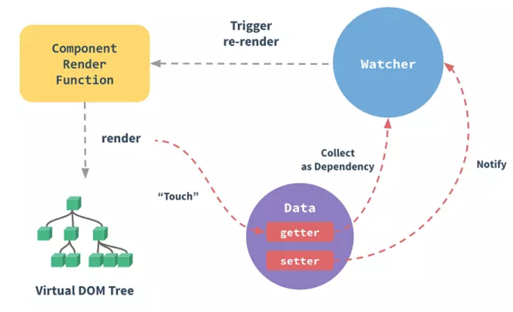

# 数据观测

## What

什么是数据观测？vue 是数据驱动的，数据改变就会导致视图改变。所以要点就是 vue 如何知道数据的变化，数据变化后如何更新对应的视图。其实最核心的方法便是通过 `Object.defineProperty()`来实现对属性的访问劫持和变化劫持。

## Why

vue 的内部其实有很多个重要的部分，数据观测，模板编译，virtualDOM，整体运行流程等，
数据观测是 vue 框架中的一个重要部分，了解其原理有助于提高对 vue 的理解和使用。

## How

Vue 的数据观测，核心机制是 **观察者模式**。
数据是被观察的一方，当数据发生变化时，通知所有的观察者，这样观察者可以做出响应。比如，重新渲染视图。
我们把依赖数据的观察者称为 watcher。这种关系可以表示为：`data -> watcher`
数据可以有多个观察者，怎么记录这种依赖关系呢？

Vue 通过在 data 和 watcher 间创建一个 dep 对象，来记录这种依赖关系：
`data - dep -> watcher`
dep 的结构很简单，除了唯一标识属性 id，另一个属性就是用于记录所有观察者的 subs。

接下来我们就来具体分析源码。
先找到数据观测方法的入口所在的地方，是`initData`或者`observe`，当 data 为空的时候就直接执行`observe`。

```js{9,11}
export function initState(vm: Component) {
  vm._watchers = [];
  const opts = vm.$options;
  if (opts.props) initProps(vm, opts.props);
  if (opts.methods) initMethods(vm, opts.methods);

  //开始处理option中的data
  if (opts.data) {
    initData(vm);
  } else {
    observe((vm._data = {}), true /* asRootData */);
  }
  if (opts.computed) initComputed(vm, opts.computed);
  if (opts.watch && opts.watch !== nativeWatch) {
    initWatch(vm, opts.watch);
  }
}
```

`initData`主要做了几件事情:

- 从 vm 上获取 data 对象。
- 判断 data 对象的每一个 key，不可以和 props、methods 中的 key 相同。否则会报警告。可以看出优先级是 methods > props > data。
- 代理 vm.\_data 到 vm 上，就可以通过通过 this.xxx 访问\_data 上的属性了。
- 开始观测 data。

```js
function initData(vm: Component) {
  let data = vm.$options.data;
  // 获取data这个json对象
  data = vm._data = typeof data === "function" ? getData(data, vm) : data || {};
  if (!isPlainObject(data)) {
    data = {};
    process.env.NODE_ENV !== "production" &&
      warn(
        "data functions should return an object:\n" +
          "https://vuejs.org/v2/guide/components.html#data-Must-Be-a-Function",
        vm
      );
  }

  const keys = Object.keys(data);
  const props = vm.$options.props;
  const methods = vm.$options.methods;
  let i = keys.length;
  while (i--) {
    const key = keys[i];
    if (process.env.NODE_ENV !== "production") {
      if (methods && hasOwn(methods, key)) {
        warn(
          `Method "${key}" has already been defined as a data property.`,
          vm
        );
      }
    }
    if (props && hasOwn(props, key)) {
      process.env.NODE_ENV !== "production" &&
        warn(
          `The data property "${key}" is already declared as a prop. ` +
            `Use prop default value instead.`,
          vm
        );
    } else if (!isReserved(key)) {
      // 通过this.xxx访问_data
      proxy(vm, `_data`, key);
    }
  }
  // observe data
  // 开始观察data
  observe(data, true /* asRootData */);
  // data:{
  //   a:1,
  //   b:2,
  //   c:{
  //     d:4
  //   }
  // }
}
```

我们看到调用 observe 方法给其传了两个参数，第一个就是 data 对象，第二个就是是否作为根 data 的标志。
如下代码就是 observe 方法具体的实现过程。
这个函数最终返回了 ob，ob 就是 Observer 的实例，是通过 data 初始化的。data 必须是对象或数组,否则不继续。如果 value 是数组或普通对象且可继承，则用它来初始化一个 Observer 实例。如果 data 有`__ob__`属性,并且`__ob__`属性引用的是 Observer 的实例,则`ob = value.__ob__`。`__ob__`这个属性是在初始化 Observer 实例的时候加上的。有了这个属性就表示这个对象被观测过。

```js
/**
 * Attempt to create an observer instance for a value,
 * returns the new observer if successfully observed,
 * or the existing observer if the value already has one.
 * 开始观测对象或数组
 */
export function observe(value: any, asRootData: ?boolean): Observer | void {
  // data必须是对象或数组,否则不继续
  if (!isObject(value) || value instanceof VNode) {
    return;
  }
  let ob: Observer | void;
  // 如果data有__ob__属性,并且__ob__属性引用的是Observer的实例,则ob = value.__ob__
  if (hasOwn(value, "__ob__") && value.__ob__ instanceof Observer) {
    ob = value.__ob__;
  } else if (
    // 如果value是数组或普通对象且可继承，则用它来初始化一个Observer实例
    shouldObserve &&
    !isServerRendering() &&
    (Array.isArray(value) || isPlainObject(value)) &&
    Object.isExtensible(value) &&
    !value._isVue
  ) {
    ob = new Observer(value);
  }
  if (asRootData && ob) {
    ob.vmCount++;
  }
  // 返回observer实例
  return ob;
}
```

`new Observer(value)`这里面具体做了什么呢？
先看 constructor,做了几件事：

- 把 data 自身赋值到 observer 实例的 value 属性,
- 生成一个 dep 对象,赋值到 observer 实例的 dep 属性,
- 给自身添加一个`__ob__`属性，引用 observer 实例,
- 如果 value 是对象,就调用`walk(value)`方法遍历这个对象的属性，
- 如果 value 是数组，就调用`observeArray(value)`方法，观测数组的每个元素。
- 对于数组，需要拦截对数组的变异方法，当数组元素改变的时候，可以触发对应的依赖。`protoAugment`和`copyAugment`就是做这样的事。
  `observeArray(value)`方法会遍历数组中的每一项，执行`observe(items[i])`,对每一项进行观测。
  `walk(value)`方法遍历这个对象的属性，对每个属性调用`defineReactive(obj, keys[i])`,设置其 getter 和 setter 方法。

```js
/**
 * Observer class that is attached to each observed
 * object. Once attached, the observer converts the target
 * object's property keys into getter/setters that
 * collect dependencies and dispatch updates.
 */
export class Observer {
  value: any;
  dep: Dep;
  vmCount: number; // number of vms that has this object as root $data

  //value就是data，是对象或者数组
  constructor(value: any) {
    // 把data自身赋值到observer实例的value属性
    this.value = value;
    // 生成一个dep对象
    this.dep = new Dep();

    this.vmCount = 0;

    //给自身添加一个__ob__属性，引用observer实例
    def(value, "__ob__", this);

    // 如果value是数组，就观测数组的每个元素
    if (Array.isArray(value)) {
      if (hasProto) {
        protoAugment(value, arrayMethods);
      } else {
        copyAugment(value, arrayMethods, arrayKeys);
      }
      this.observeArray(value);
    } else {
      // 如果value是对象,就遍历这个对象的属性
      this.walk(value);
    }
  }

  /**
   * Walk through each property and convert them into
   * getter/setters. This method should only be called when
   * value type is Object.
   * 遍历对象的属性
   */
  walk(obj: Object) {
    const keys = Object.keys(obj);
    for (let i = 0; i < keys.length; i++) {
      defineReactive(obj, keys[i]);
    }
  }

  /**
   * Observe a list of Array items.
   */
  observeArray(items: Array<any>) {
    for (let i = 0, l = items.length; i < l; i++) {
      observe(items[i]);
    }
  }
}
```

接下来我们分析一下`defineReactive`方法,第一个参数是 data 对象，第二个参数是对象的某个 key。
这个方法做了如下几件事情。

- new 一个 dep 实例，每个 key 都在 getter 和 setter 中引用了一个 dep。这个 dep 就是用来收集每个 key 的依赖的。
- 获取属性原来的属性描述对象,若该属性为不可配置的，则不继续。获取属性已有的 getter 和 setter 方法，获取属性的值`val`。
- 观测属性的值`observe(val)`，把观测过的值赋值给变量`childOb`
- 调用`Object.defineProperty(obj,key,{})`定义这个属性的 getter 和 setter.

  - 先看 getter，第一句，`const value = getter ? getter.call(obj) : val;`这个属性若有原 getter，则执行原 getter 读取值，否则直接读取属性的值。getter 最后 return 了 value。中间的 if 语句块就是收集依赖的过程。

  ```js
  // 如果有依赖，就收集依赖到这个属性的dep对象的subs里
  if (Dep.target) {
    dep.depend();
    // {
    //   person:[1,{name:2}]
    // }
    // 如果这个属性的值可观测（是对象或者数组才能被观测），就收集同样的依赖到这个属性值的observer实例的dep中
    if (childOb) {
      childOb.dep.depend();
      // 如果这个值是数组，且数组的项已被观测（是对象或者数组才能被观测），就收集同样的依赖到每个数组元素
      if (Array.isArray(value)) {
        dependArray(value);
      }
    }
  }
  ```

  - 再看 setter，前面两句对`newVal`做了边界和异常值`NaN`的判断，如果属性的新值和旧值相等或者新值和旧值都是 NaN，则不继续。接下来如果有自定义 setter 通过参数传入，则执行自定义的 setter。如果这个属性已有 setter，则执行已有 setter，否则将新值赋值给这个属性。

  ```js
  if (setter) {
    setter.call(obj, newVal);
  } else {
    val = newVal;
  }
  ```

  新值也要被观测,所以执行`observe(newVal)`。当值改变的时候，出发此属性收集的依赖。

  ```js
  // 新值也要被观测
  childOb = !shallow && observe(newVal);
  // 触发此属性收集的依赖
  dep.notify();
  ```

```js
/**
 * Define a reactive property on an Object.
 * 响应化一个属性
 */
export function defineReactive(
  obj: Object, // 对象
  key: string, // 对象的某个key
  val: any,
  customSetter?: ?Function,
  shallow?: boolean
) {
  // 生成一个dep实例，每个key都在get和set中引用了一个dep
  const dep = new Dep();

  // 获取属性原来的属性描述对象,若该属性为不可配置的，则不继续
  const property = Object.getOwnPropertyDescriptor(obj, key);
  if (property && property.configurable === false) {
    return;
  }

  // cater for pre-defined getter/setters
  // 获取属性已有的getter和setter方法
  const getter = property && property.get;
  const setter = property && property.set;

  if ((!getter || setter) && arguments.length === 2) {
    val = obj[key]; // 获取属性的值
  }

  // 观测属性的值
  let childOb = !shallow && observe(val);

  // 定义这个属性的get和set
  Object.defineProperty(obj, key, {
    enumerable: true,
    configurable: true,
    // 读取这个属性值的时候执行get
    get: function reactiveGetter() {
      // 这个属性若有原getter，则执行原getter读取值，否则直接读取属性的值
      const value = getter ? getter.call(obj) : val;
      // 如果有依赖，就收集依赖到这个属性的dep对象的subs里
      if (Dep.target) {
        dep.depend();
        // {
        //   person:[1,{name:2}]
        // }
        // 如果这个属性的值可观测（是对象或者数组才能被观测），就收集同样的依赖到这个属性值的observer实例的dep中
        if (childOb) {
          childOb.dep.depend();
          // 如果这个值是数组，且数组的项已被观测（是对象或者数组才能被观测），就收集同样的依赖到每个数组元素
          if (Array.isArray(value)) {
            dependArray(value);
          }
        }
      }
      // 返回属性的值
      return value;
    },
    // 改变这个属性值的时候执行set
    set: function reactiveSetter(newVal) {
      // 获取属性的值
      const value = getter ? getter.call(obj) : val;

      /* eslint-disable no-self-compare */
      // 如果属性的新值和旧值相等或者新值和旧值都是NaN，则不继续
      if (newVal === value || (newVal !== newVal && value !== value)) {
        return;
      }
      /* eslint-enable no-self-compare */
      // 如果有自定义setter通过参数传入，则执行自定义的setter
      if (process.env.NODE_ENV !== "production" && customSetter) {
        customSetter();
      }
      // #7981: for accessor properties without setter
      if (getter && !setter) return;
      // 如果这个属性已有setter，则执行已有setter，否则将新值赋值给这个属性
      if (setter) {
        setter.call(obj, newVal);
      } else {
        val = newVal;
      }
      // 新值也要被观测
      childOb = !shallow && observe(newVal);
      // 触发此属性收集的依赖
      dep.notify();
    }
  });
}
```

## 总结


最后掏出 vue 官网上的一张图，这张图其实非常清晰，就是一个变化侦测的原理图。

`getter` 到 `watcher` 有一条线，上面写着收集依赖，意思是说 `getter` 里收集 `watcher`，也就是说当数据发生 `get` 动作时开始收集 `watcher`。

`setter` 到 `watcher` 有一条线，写着 `Notify` 意思是说在 `setter` 中触发消息，也就是当数据发生 `set` 动作时，通知 `watcher`。

`Watcher` 到 `ComponentRenderFunction` 有一条线，写着 `Trigger re-render`,意思就是用新的数据去执行`ComponentRenderFunction`，`render`一个`Virtual DOM Tree`。

render 到 getter 有一条线，写着`Touch`，意思就是在执行`ComponentRenderFunction`的时候，访问数据，执行`getter`
