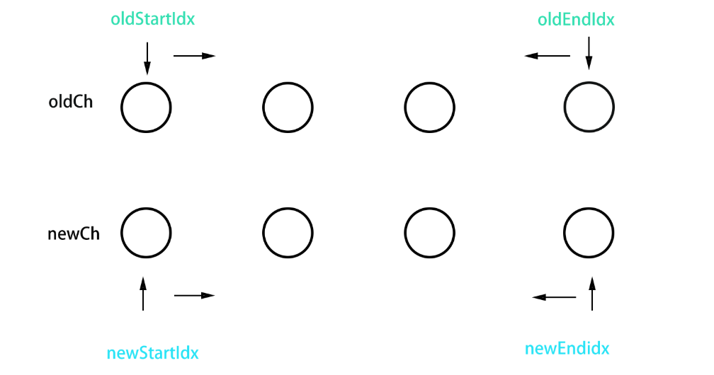
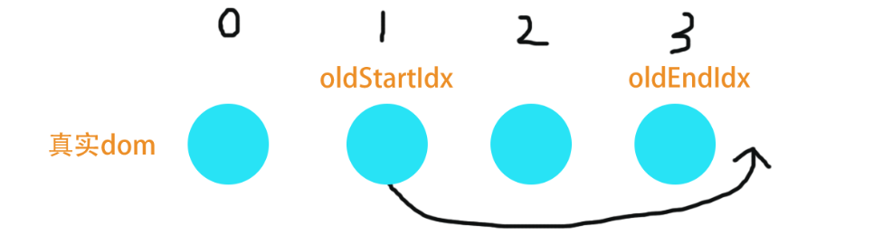
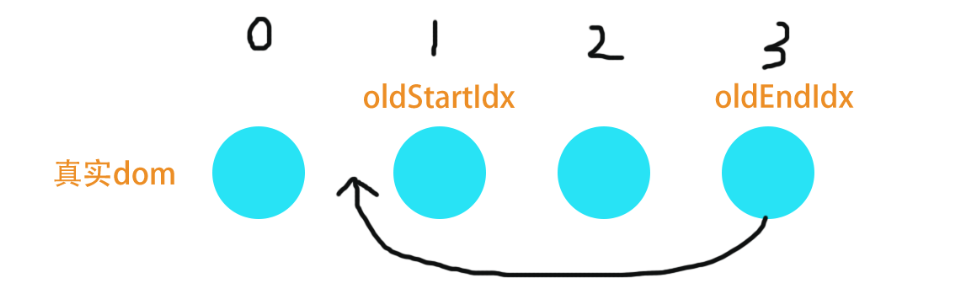
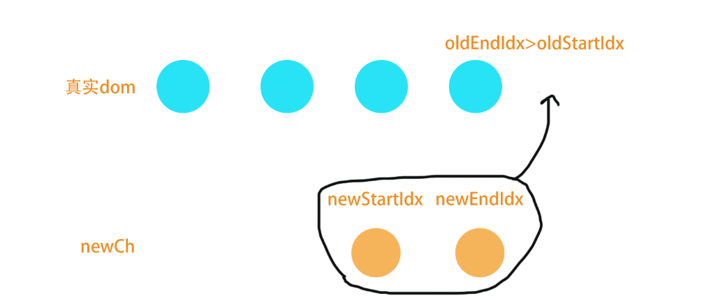
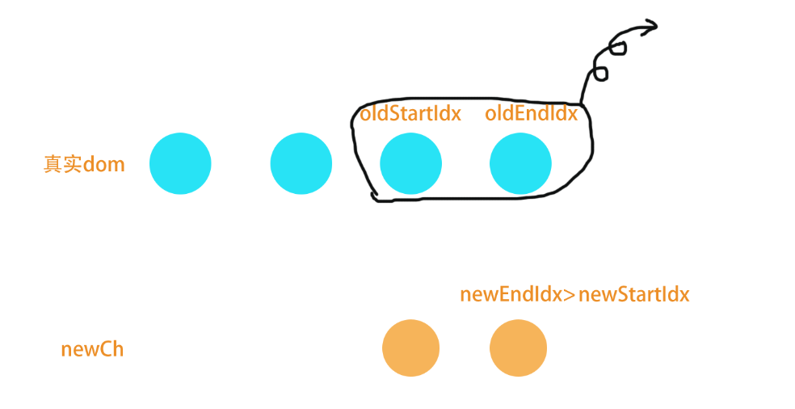
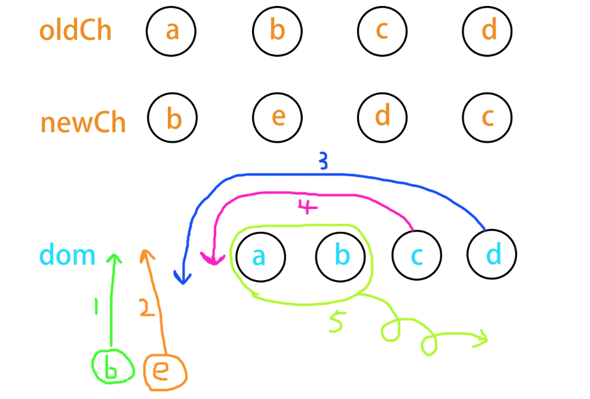
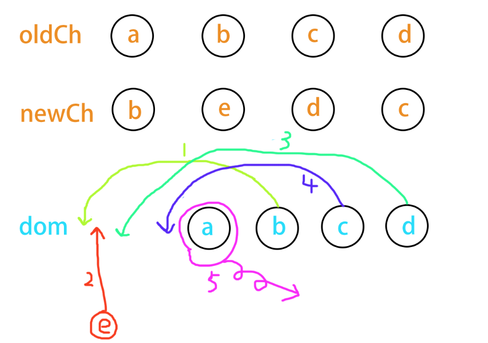

# diff 算法 与 patch （第三部分）

## What

UpdateChildren : 更新子节点

## How

```js
/**
 *  oldCh:oldVNode chirdren
 *  newCh:newVNode chirdren
 *  StartIdx   开头索引
 *  EndIdx     结束索引
 *  vnode中的key，可以作为节点的标识
 * **/
```

1、oldCh 和 newCh 各有两个头尾的变量 StartIdx 和 EndIdx，它们的 2 个变量相互比较，一共有 4 种比较方式。

2、如果 4 种比较都没匹配，就会用 key 进行比较：拿 newStartVnode 的 key 值在 oldCh 中遍历，如果存在相同 key 的节点并且 与 newStartVnode 是相同节点，则移动 Dom 节点，否则创建新元素。。

3、在比较的过程中，变量会往中间靠，一旦 StartIdx>EndIdx 表明 oldCh 和 newCh 至少有一个已经遍历完了，就会结束比较。
<br/>

#### 具体流程，上代码：

```js
let oldStartIdx = 0;
let newStartIdx = 0;
let oldEndIdx = oldCh.length - 1;
let oldStartVnode = oldCh[0];
let oldEndVnode = oldCh[oldEndIdx];
let newEndIdx = newCh.length - 1;
let newStartVnode = newCh[0];
let newEndVnode = newCh[newEndIdx];
let oldKeyToIdx, idxInOld, vnodeToMove, refElm;
```

1、`oldStartIdx <= oldEndIdx && newStartIdx <= newEndIdx`时遍历的过程：

索引图：


<br/>

1.1、

```js
//2种情况，只移动索引
if (isUndef(oldStartVnode)) {
    oldStartVnode = oldCh[++oldStartIdx]; // Vnode has been moved left
} else if (isUndef(oldEndVnode)) {
    oldEndVnode = oldCh[--oldEndIdx];
}
```

1.2、oldCh 和 newCh 各自的两个头尾的变量 StartIdx 和 EndIdx，它们每 2 个变量相互比较，一共有以下 4 种比较方式，索引不断向中间靠拢

```js

else if (sameVnode(oldStartVnode, newStartVnode)) {
    //不需要对dom进行移动
    patchVnode(oldStartVnode, newStartVnode, insertedVnodeQueue);
    oldStartVnode = oldCh[++oldStartIdx];
    newStartVnode = newCh[++newStartIdx];
} else if (sameVnode(oldEndVnode, newEndVnode)) {
    //不需要对dom进行移动
    patchVnode(oldEndVnode, newEndVnode, insertedVnodeQueue);
    oldEndVnode = oldCh[--oldEndIdx];
    newEndVnode = newCh[--newEndIdx];
}
```

```js
else if (sameVnode(oldStartVnode, newEndVnode)) {
    /**当oldStartVnode，newEndVnode是相同节点，说明oldStartVnode.el跑到oldEndVnode.el的后边了。
     **/
    patchVnode(oldStartVnode, newEndVnode, insertedVnodeQueue);
    canMove &&
        nodeOps.insertBefore(
            parentElm,
            oldStartVnode.elm,
            nodeOps.nextSibling(oldEndVnode.elm)
        );
    oldStartVnode = oldCh[++oldStartIdx];
    newEndVnode = newCh[--newEndIdx];
}
```

如图：

<br/>

```js
else if (sameVnode(oldEndVnode, newStartVnode)) {
    /** 当oldEndVnode，newStartVnode是相同节点，说明 oldEndVnode.el跑到了oldStartVnode.el的前边。
     **/
    patchVnode(oldEndVnode, newStartVnode, insertedVnodeQueue);
    canMove &&
        nodeOps.insertBefore(
            parentElm,
            oldEndVnode.elm,
            oldStartVnode.elm
        );
    oldEndVnode = oldCh[--oldEndIdx];
    newStartVnode = newCh[++newStartIdx];
}
```

如图：


<br/>

1.3、以上 4 种比较方法没有成功后，开始用 key 进行比较

```js
if (isUndef(oldKeyToIdx))
    /**
     * createKeyToOldIdx生成一个key与oldVnode的索引对应的map,只有第一次进来undefined的时候会生成
     **/
    oldKeyToIdx = createKeyToOldIdx(oldCh, oldStartIdx, oldEndIdx);
/**如果newStartVnode存在key, 返回这个key在oldVnode中的索引值（即第几个节点，下标），否则调用findIdxInOld方法查找key在oldVnode中的索引值
 **/
idxInOld = isDef(newStartVnode.key)
    ? oldKeyToIdx[newStartVnode.key]
    : findIdxInOld(newStartVnode, oldCh, oldStartIdx, oldEndIdx);
if (isUndef(idxInOld)) {
    //newStartVnode没有key或者是该key没有在老节点中找到，则创建一个新的节点
    createElm(
        newStartVnode,
        insertedVnodeQueue,
        parentElm,
        oldStartVnode.elm,
        false,
        newCh,
        newStartIdx
    );
} else {
    /**获取相同key的老节点**/
    vnodeToMove = oldCh[idxInOld];
    if (sameVnode(vnodeToMove, newStartVnode)) {
        //相同key值的vnodeToMove 与 newStartVnode 是同一个节点，将vnodeToMove.elm 插入到oldStartVnode.elm前面
        patchVnode(vnodeToMove, newStartVnode, insertedVnodeQueue);
        oldCh[idxInOld] = undefined;
        canMove &&
            nodeOps.insertBefore(parentElm, vnodeToMove.elm, oldStartVnode.elm);
    } else {
        // same key but different element. treat as new element
        createElm(
            newStartVnode,
            insertedVnodeQueue,
            parentElm,
            oldStartVnode.elm,
            false,
            newCh,
            newStartIdx
        );
    }
}
newStartVnode = newCh[++newStartIdx];
```

<br/>

2、当`oldStartIdx > oldEndIdx`时，表示 oldCh 已经先遍历结束，即 newCh 还没有遍历完，则 newStartIdx 和 newEndIdx 之间的 vnode 是新增的，则插入新节点

```js
if (oldStartIdx > oldEndIdx) {
    //添加新节点
    refElm = isUndef(newCh[newEndIdx + 1]) ? null : newCh[newEndIdx + 1].elm;
    addVnodes(
        parentElm,
        refElm,
        newCh,
        newStartIdx,
        newEndIdx,
        insertedVnodeQueue
    );
}
```

如图：


<br/>

3、当`newStartIdx > newEndIdx`时，表示 newCh 已经先遍历结束，说明 oldCh 中剩余的节点在新的子节点里已经不存在了，此时应该删除 oldStartIdx 和 oldEndIdx 之间的 vnode

```js
else if (newStartIdx > newEndIdx) {
    //删除老节点
    removeVnodes(parentElm, oldCh, oldStartIdx, oldEndIdx);
}
```

如图：


<br/>

## 自我检测

最后，引用网上一个例子，画出了 diff 完整的过程，每一步 dom 的变化都用不同颜色的线标出，大家可以自我检测一下是否掌握了 diff 过程：

1、a,b,c,d,e 假设是 4 个不同的元素，我们没有设置 key 时，b 没有复用，而是直接创建新的，删除旧的。

如图：

<br/><br/>

2、当我们给 4 个元素加上唯一 key 时，b 得到了的复用。

如图：


<br/>

> <font color=gray size=3> 图片来源于：[https://github.com/aooy/blog/issues/2](https://github.com/aooy/blog/issues/2)</font>

<br/>

::: tip 注释
[查看 vue 相关源码](https://github.com/510team/vue-resource-analysis/blob/master/src/core/vdom/patch.js)
:::
