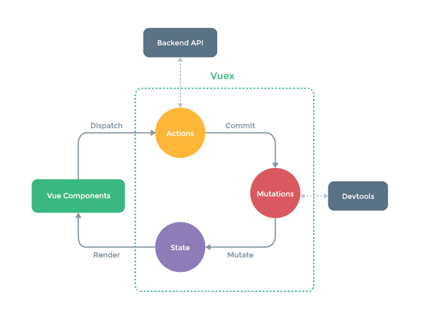

# vuex 简介

官网介绍说 Vuex 是一个专为 Vue.js 应用程序开发的状态管理模式。它采用集中式存储管理应用的所有组件的状态，并以相应的规则保证状态以一种可预测的方式发生变化。数据流的状态非常清晰，按照 组件 dispatch Action -> action 内部 commit Mutation -> Mutation 再 mutate state 的数据，在触发 render 函数引起视图的更新。附上一张官网的流程图及 vuex 的官网地址：[https://vuex.vuejs.org/zh/](https://vuex.vuejs.org/zh/)

## Questions

在使用 Vuex 的时候，大家有没有如下几个疑问，带着这几个疑问，再去看源码，从中找到解答，这样对 vuex 的理解可以加深一些。

1. 官网在严格模式下有说明：在严格模式下，无论何时发生了状态变更且不是由 mutation 函数引起的，将会抛出错误。vuex 是如何检测状态改变是由 mutation 函数引起的？
2. 通过在根实例中注册 store 选项，该 store 实例会注入到根组件下的所有子组件中。为什么所有子组件都可以取到 store？
3. 为什么用到的属性在 state 中也必须要提前定义好，vue 视图才可以响应？
4. 在调用 dispatch 和 commit 时，只需传入（type, payload），为什么 action 函数和 mutation 函数能够在第一个参数中解构出来 state、commit 等？
   带着这些问题，我们来看看 vuex 的源码，从中寻找到答案。
