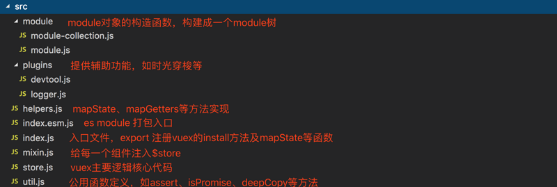
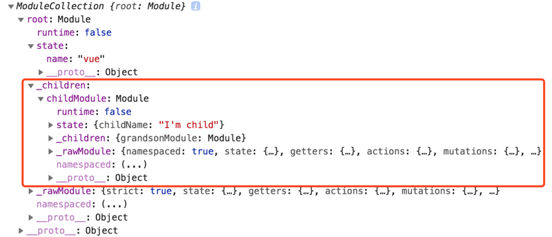
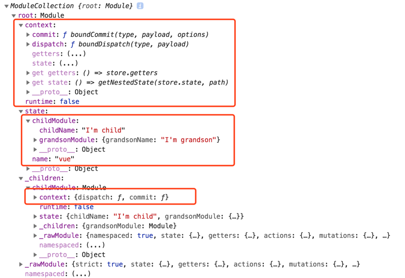
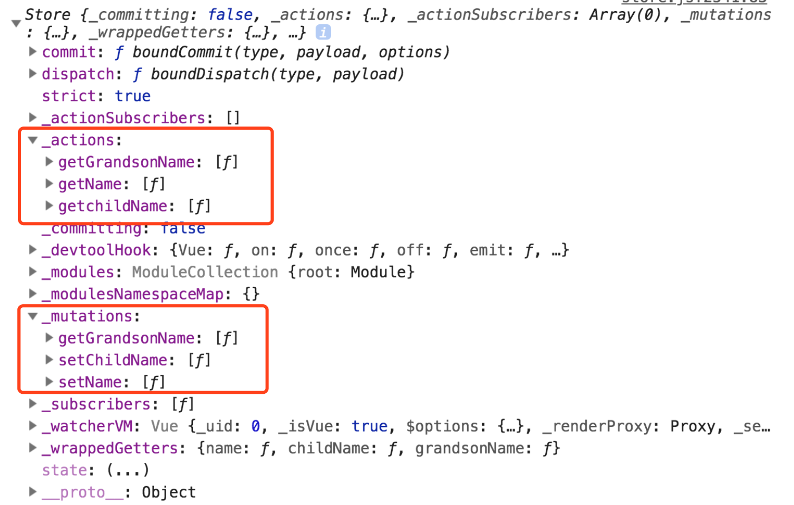
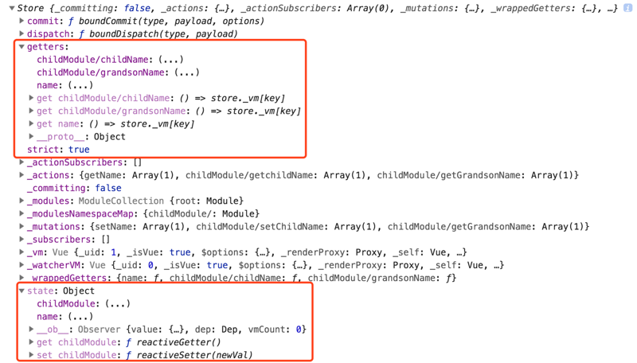

## 源码目录结构

vuex 的源码结构非常简洁清晰，代码量也不是很大，大家不要感到恐慌。



## vuex 挂载

vue 使用插件的方法很简单，只需 Vue.use(Plugins)，对于 vuex，只需要 Vue.use(Vuex) 即可。在 use 的内部是如何实现插件的注册呢？读过 vue 源码的都知道，如果传入的参数有 install 方法，则调用插件的 install 方法，如果传入的参数本身是一个 function，则直接执行。那么我们接下来就需要去 vuex 暴露出来的 install 方法去看看具体干了什么。

store.js

```js
export function install(_Vue) {
    // vue.use原理：调用插件的install方法进行插件注册，并向install方法传递Vue对象作为第一个参数
    if (Vue && _Vue === Vue) {
        if (process.env.NODE_ENV !== "production") {
            console.error(
                "[vuex] already installed. Vue.use(Vuex) should be called only once."
            );
        }
        return;
    }
    Vue = _Vue; // 为了引用vue的watch方法
    applyMixin(Vue);
}
```

在 install 中，将 vue 对象赋给了全局变量 Vue，并作为参数传给了 applyMixin 方法。那么在 applyMixin 方法中干了什么呢？

mixin.js

```js
function vuexInit() {
    const options = this.$options;
    // store injection
    if (options.store) {
        this.$store =
            typeof options.store === "function"
                ? options.store()
                : options.store;
    } else if (options.parent && options.parent.$store) {
        this.$store = options.parent.$store;
    }
}
```

在这里首先检查了一下 vue 的版本，2 以上的版本把 vuexInit 函数混入 vuex 的 beforeCreate 钩子函数中。
在 vuexInit 中，将 `new Vue()` 时传入的 store 设置到 this 对象的 `$store` 属性上，子组件则从其父组件上引用其 `$store` 属性进行层层嵌套设置，保证每一个组件中都可以通过 this.\$store 取到 store 对象。
这也就解答了我们问题 2 中的问题。通过在根实例中注册 store 选项，该 store 实例会注入到根组件下的所有子组件中，注入方法是子从父拿，root 从 options 拿。

接下来让我们看看`new Vuex.Store()`。

## store 构造函数

store 对象构建的主要代码都在 store.js 中，是 vuex 的核心代码。

首先，在 constructor 中进行了 Vue 的判断，如果没有通过 Vue.use(Vuex) 进行 Vuex 的注册，则调用 install 函数注册。（ 通过 script 标签引入时不需要手动调用 Vue.use(Vuex) ）
并在非生产环境进行判断： 必须调用 Vue.use(Vuex) 进行注册，必须支持 Promise，必须用 new 创建 store。

```js
if (!Vue && typeof window !== "undefined" && window.Vue) {
    install(window.Vue);
}

if (process.env.NODE_ENV !== "production") {
    assert(Vue, `must call Vue.use(Vuex) before creating a store instance.`);
    assert(
        typeof Promise !== "undefined",
        `vuex requires a Promise polyfill in this browser.`
    );
    assert(
        this instanceof Store,
        `store must be called with the new operator.`
    );
}
```

然后进行一系列的属性初始化。其中的重点是 `new ModuleCollection(options)`，这个我们放在后面再讲。先把 constructor 中的代码过完。

```js
const { plugins = [], strict = false } = options;

// store internal state
this._committing = false; // 是否在进行提交mutation状态标识
this._actions = Object.create(null); // 保存action，_actions里的函数已经是经过包装后的
this._actionSubscribers = []; // action订阅函数集合
this._mutations = Object.create(null); // 保存mutations，_mutations里的函数已经是经过包装后的
this._wrappedGetters = Object.create(null); // 封装后的getters集合对象
// Vuex支持store分模块传入，在内部用Module构造函数将传入的options构造成一个Module对象，
// 如果没有命名模块，默认绑定在this._modules.root上
// ModuleCollection 内部调用 new Module构造函数
this._modules = new ModuleCollection(options);
this._modulesNamespaceMap = Object.create(null); // 模块命名空间map
this._subscribers = []; // mutation订阅函数集合
this._watcherVM = new Vue(); // Vue组件用于watch监视变化
```

属性初始化完毕后，首先从 this 中解构出原型上的 `dispatch` 和 `commit` 方法，并进行二次包装，将 this 指向当前 store。

```js
const store = this;
const { dispatch, commit } = this;
/**
 把 Store 类的 dispatch 和 commit 的方法的 this 指针指向当前 store 的实例上.
 这样做的目的可以保证当我们在组件中通过 this.$store 直接调用 dispatch/commit 方法时,
 能够使 dispatch/commit 方法中的 this 指向当前的 store 对象而不是当前组件的 this.
*/
this.dispatch = function boundDispatch(type, payload) {
    return dispatch.call(store, type, payload);
};
this.commit = function boundCommit(type, payload, options) {
    return commit.call(store, type, payload, options);
};
```

接着往下走，包括严格模式的设置、根 state 的赋值、模块的注册、state 的响应式、插件的注册等等，其中的重点在 `installModule` 函数中，在这里实现了所有 modules 的注册。

```js
//options中传入的是否启用严格模式
this.strict = strict;

// new ModuleCollection 构造出来的_mudules
const state = this._modules.root.state;

// 初始化组件树根组件、注册所有子组件，并将其中所有的getters存储到this._wrappedGetters属性中
installModule(this, state, [], this._modules.root);

//通过使用vue实例，初始化 store._vm，使state变成可响应的，并且将getters变成计算属性
resetStoreVM(this, state);

// 注册插件
plugins.forEach(plugin => plugin(this));

// 调试工具注册
const useDevtools =
    options.devtools !== undefined ? options.devtools : Vue.config.devtools;
if (useDevtools) {
    devtoolPlugin(this);
}
```

到此为止，constructor 中所有的代码已经分析完毕。其中的重点在 `new ModuleCollection(options)` 和 `installModule` ，那么接下来我们到它们的内部去看看，究竟都干了些什么。

## ModuleCollection

由于 Vuex 使用单一状态树，应用的所有状态会集中到一个比较大的对象。当应用变得非常复杂时，store 对象就有可能变得相当臃肿。Vuex 允许我们将 store 分割成模块（module），每个模块拥有自己的 state、mutation、action、getter、甚至是嵌套子模块。例如下面这样：

```js
const childModule = {
  state: { ... },
  mutations: { ... },
  actions: { ... }
}

const store = new Vuex.Store({
  state,
  getters,
  actions,
  mutations,
  modules: {
    childModule: childModule,
  }
})

```

有了模块的概念，可以更好的规划我们的代码。对于各个模块公用的数据，我们可以定义一个 common store，别的模块用到的话直接通过 modules 的方法引入即可，无需重复的在每一个模块都写一遍相同的代码。这样我们就可以通过 store.state.childModule 拿到 childModule 中的 state 状态， 对于 Module 的内部是如何实现的呢？

```js
export default class ModuleCollection {
    constructor(rawRootModule) {
        // 注册根module，参数是new Vuex.Store时传入的options
        this.register([], rawRootModule, false);
    }

    register(path, rawModule, runtime = true) {
        if (process.env.NODE_ENV !== "production") {
            assertRawModule(path, rawModule);
        }

        const newModule = new Module(rawModule, runtime);
        if (path.length === 0) {
            // 注册根module
            this.root = newModule;
        } else {
            // 注册子module，将子module添加到父module的_children属性上
            const parent = this.get(path.slice(0, -1));
            parent.addChild(path[path.length - 1], newModule);
        }

        // 如果当前模块有子modules，循环注册
        if (rawModule.modules) {
            forEachValue(rawModule.modules, (rawChildModule, key) => {
                this.register(path.concat(key), rawChildModule, runtime);
            });
        }
    }
}
```

在 ModuleCollection 中又调用了 Module 构造函数，构造一个 Module。

Module 构造函数

```js
constructor (rawModule, runtime) {
    // 初始化时为false
    this.runtime = runtime
    // 存储子模块
    this._children = Object.create(null)
    // 将原来的module存储，以备后续使用
    this._rawModule = rawModule
    const rawState = rawModule.state
    // 存储原来module的state
    this.state = (typeof rawState === 'function' ? rawState() : rawState) || {}
  }
```

通过以上代码可以看出，ModuleCollection 主要将传入的 options 对象整个构造为一个 Module 对象，并循环调用 this.register([key], rawModule, false) 为其中的 modules 属性进行模块注册，使其都成为 Module 对象，最后 options 对象被构造成一个完整的 Module 树。

经过 ModuleCollection 构造后的树结构如下：（以上面的例子生成的树结构）



模块已经创建好之后，接下来要做的就是 installModule。

## installModule

首先我们来看一看执行完 constructor 中的 installModule 函数后，这棵树的结构如何？



从上图中可以看出，在执行完 installModule 函数后，每一个 module 中的 state 属性都增加了 其子 module 中的 state 属性，但此时的 state 还不是响应式的，并且新增加了 context 这个对象。里面包含 dispatch 、 commit 等函数以及 state 、 getters 等属性。它就是 vuex 官方文档中所说的`Action 函数接受一个与 store 实例具有相同方法和属性的 context 对象` 这个 context 对象。我们平时在 store 中调用的 dispatch 和 commit 就是从这里解构出来的。接下来让我们看看 installModule 里面执行了什么。

```js
function installModule(store, rootState, path, module, hot) {
    // 判断是否是根节点，跟节点的path = []
    const isRoot = !path.length;

    // 取命名空间，形式类似'childModule/'
    const namespace = store._modules.getNamespace(path);

    // 如果namespaced为true，存入_modulesNamespaceMap中
    if (module.namespaced) {
        store._modulesNamespaceMap[namespace] = module;
    }

    // 不是根节点，把子组件的每一个state设置到其父级的state属性上
    if (!isRoot && !hot) {
        // 获取当前组件的父组件state
        const parentState = getNestedState(rootState, path.slice(0, -1));
        // 获取当前Module的名字
        const moduleName = path[path.length - 1];
        store._withCommit(() => {
            Vue.set(parentState, moduleName, module.state);
        });
    }

    // 给context对象赋值
    const local = (module.context = makeLocalContext(store, namespace, path));

    // 循环注册每一个module的Mutation
    module.forEachMutation((mutation, key) => {
        const namespacedType = namespace + key;
        registerMutation(store, namespacedType, mutation, local);
    });

    // 循环注册每一个module的Action
    module.forEachAction((action, key) => {
        const type = action.root ? key : namespace + key;
        const handler = action.handler || action;
        registerAction(store, type, handler, local);
    });

    // 循环注册每一个module的Getter
    module.forEachGetter((getter, key) => {
        const namespacedType = namespace + key;
        registerGetter(store, namespacedType, getter, local);
    });

    // 循环_childern属性
    module.forEachChild((child, key) => {
        installModule(store, rootState, path.concat(key), child, hot);
    });
}
```

在 installModule 函数里，首先判断是否是根节点、是否设置了命名空间。在设置了命名空间的前提下，把 module 存入 store.\_modulesNamespaceMap 中。在不是跟节点并且不是 hot 的情况下，通过 getNestedState 获取到父级的 state，并获取当前 module 的名字， 用 Vue.set() 方法将当前 module 的 state 挂载到父 state 上。然后调用 makeLocalContext 函数给 module.context 赋值，设置局部的 dispatch、commit 方法以及 getters 和 state。那么来看一看这个函数。

```js
function makeLocalContext(store, namespace, path) {
    // 是否有命名空间
    const noNamespace = namespace === "";

    const local = {
        // 如果没有命名空间，直接返回store.dispatch；否则给type加上命名空间，类似'childModule/'这种
        dispatch: noNamespace
            ? store.dispatch
            : (_type, _payload, _options) => {
                  const args = unifyObjectStyle(_type, _payload, _options);
                  const { payload, options } = args;
                  let { type } = args;

                  if (!options || !options.root) {
                      type = namespace + type;
                      if (
                          process.env.NODE_ENV !== "production" &&
                          !store._actions[type]
                      ) {
                          console.error(
                              `[vuex] unknown local action type: ${
                                  args.type
                              }, global type: ${type}`
                          );
                          return;
                      }
                  }

                  return store.dispatch(type, payload);
              },
        // 如果没有命名空间，直接返回store.commit；否则给type加上命名空间
        commit: noNamespace
            ? store.commit
            : (_type, _payload, _options) => {
                  const args = unifyObjectStyle(_type, _payload, _options);
                  const { payload, options } = args;
                  let { type } = args;

                  if (!options || !options.root) {
                      type = namespace + type;
                      if (
                          process.env.NODE_ENV !== "production" &&
                          !store._mutations[type]
                      ) {
                          console.error(
                              `[vuex] unknown local mutation type: ${
                                  args.type
                              }, global type: ${type}`
                          );
                          return;
                      }
                  }

                  store.commit(type, payload, options);
              }
    };

    // getters and state object must be gotten lazily
    // because they will be changed by vm update
    Object.defineProperties(local, {
        getters: {
            get: noNamespace
                ? () => store.getters
                : () => makeLocalGetters(store, namespace)
        },
        state: {
            get: () => getNestedState(store.state, path)
        }
    });

    return local;
}
```

经过 makeLocalContext 处理的返回值会赋值给 local 变量，这个变量会传递给 registerMutation、forEachAction、registerGetter 函数去进行相应的注册。

mutation 可以重复注册，registerMutation 函数将我们传入的 mutation 进行了一次包装，将 state 作为第一个参数传入，因此我们在调用 mutation 的时候可以从第一个参数中取到当前的 state 值。

```js
function registerMutation(store, type, handler, local) {
    const entry = store._mutations[type] || (store._mutations[type] = []);
    entry.push(function wrappedMutationHandler(payload) {
        // 将this指向store，将makeLocalContext返回值中的state作为第一个参数，调用值执行的payload作为第二个参数
        // 因此我们调用commit去提交mutation的时候，可以从mutation的第一个参数中取到当前的state值。
        handler.call(store, local.state, payload);
    });
}
```

action 也可以重复注册。注册 action 的方法与 mutation 相似，registerAction 函数也将我们传入的 action 进行了一次包装。但是 action 中参数会变多，里面包含 dispatch 、commit、local.getters、local.state、rootGetters、rootState，因此可以在一个 action 中 dispatch 另一个 action 或者去 commit 一个 mutation。这里也就解答了问题 4 中提出的疑问。

```js
function registerAction(store, type, handler, local) {
    const entry = store._actions[type] || (store._actions[type] = []);
    entry.push(function wrappedActionHandler(payload, cb) {
        //与mutation不同，action的第一个参数是一个对象，里面包含dispatch、commit、getters、state、rootGetters、rootState
        let res = handler.call(
            store,
            {
                dispatch: local.dispatch,
                commit: local.commit,
                getters: local.getters,
                state: local.state,
                rootGetters: store.getters,
                rootState: store.state
            },
            payload,
            cb
        );
        if (!isPromise(res)) {
            res = Promise.resolve(res);
        }
        if (store._devtoolHook) {
            return res.catch(err => {
                store._devtoolHook.emit("vuex:error", err);
                throw err;
            });
        } else {
            return res;
        }
    });
}
```

注册 getters，从 getters 的第一个参数中可以取到 local state、local getters、root state、root getters。getters 不允许重复注册。

```js
function registerGetter(store, type, rawGetter, local) {
    // getters不允许重复
    if (store._wrappedGetters[type]) {
        if (process.env.NODE_ENV !== "production") {
            console.error(`[vuex] duplicate getter key: ${type}`);
        }
        return;
    }

    store._wrappedGetters[type] = function wrappedGetter(store) {
        // getters的第一个参数包含local state、local getters、root state、root getters
        return rawGetter(
            local.state, // local state
            local.getters, // local getters
            store.state, // root state
            store.getters // root getters
        );
    };
}
```

现在 store 的 \_mutation、\_action 中已经有了我们自行定义的的 mutation 和 action 函数，并且经过了一层内部报装。当我们在组件中执行 `this.$store.dispatch()` 和 `this.$store.commit()` 的时候，是如何调用到相应的函数的呢？接下来让我们来看一看 store 上的 dispatch 和 commit 函数。

## commit

commit 函数先进行参数的适配处理，然后判断当前 action type 是否存在，如果存在则调用 \_withCommit 函数执行相应的 mutation 。

```js
  // 提交mutation函数
  commit(_type, _payload, _options) {
    // check object-style commit
    //commit支持两种调用方式，一种是直接commit('getName','vuex'),另一种是commit({type:'getName',name:'vuex'}),
    //unifyObjectStyle适配两种方式
    const { type, payload, options } = unifyObjectStyle(
      _type,
      _payload,
      _options
    );

    const mutation = { type, payload };
    // 这里的entry取值就是我们在registerMutation函数中push到_mutations中的函数，已经经过处理
    const entry = this._mutations[type];
    if (!entry) {
      if (process.env.NODE_ENV !== "production") {
        console.error(`[vuex] unknown mutation type: ${type}`);
      }
      return;
    }

    // 专用修改state方法，其他修改state方法均是非法修改，在严格模式下，无论何时发生了状态变更且不是由 mutation 函数引起的，将会抛出错误
    // 不要在发布环境下启用严格模式！严格模式会深度监测状态树来检测不合规的状态变更——请确保在发布环境下关闭严格模式，以避免性能损失。
    this._withCommit(() => {
      entry.forEach(function commitIterator(handler) {
        handler(payload);
      });
    });

    // 订阅者函数遍历执行，传入当前的mutation对象和当前的state
    this._subscribers.forEach(sub => sub(mutation, this.state));

    if (process.env.NODE_ENV !== "production" && options && options.silent) {
      console.warn(
        `[vuex] mutation type: ${type}. Silent option has been removed. ` +
          "Use the filter functionality in the vue-devtools"
      );
    }
  }
```

在 commit 函数中调用了 \_withCommit 这个函数， 代码如下。
\_withCommit 是一个代理方法，所有触发 mutation 的进行 state 修改的操作都经过它，由此来统一管理监控 state 状态的修改。在严格模式下，会深度监听 state 的变化，如果没有通过 mutation 去修改 state，则会报错。官方建议 **不要在发布环境下启用严格模式！** 请确保在发布环境下关闭严格模式，以避免性能损失。这里就解答了问题 1 中的疑问。

```js
_withCommit(fn) {
    // 保存之前的提交状态false
    const committing = this._committing;

    // 进行本次提交，若不设置为true，直接修改state，strict模式下，Vuex将会产生非法修改state的警告
    this._committing = true;

    // 修改state
    fn();

    // 修改完成，还原本次修改之前的状态false
    this._committing = committing;
}
```

## dispatch

dispatch 和 commit 的原理相同。如果有多个同名 action，会等到所有的 action 函数完成后，返回的 Promise 才会执行。

```js
// 触发action函数
  dispatch(_type, _payload) {
    // check object-style dispatch
    const { type, payload } = unifyObjectStyle(_type, _payload);

    const action = { type, payload };
    const entry = this._actions[type];
    if (!entry) {
      if (process.env.NODE_ENV !== "production") {
        console.error(`[vuex] unknown action type: ${type}`);
      }
      return;
    }

    // 执行所有的订阅者函数
    this._actionSubscribers.forEach(sub => sub(action, this.state));

    return entry.length > 1
      ? Promise.all(entry.map(handler => handler(payload)))
      : entry[0](payload);
  }
```

至此，整个 installModule 里涉及到的内容已经分析完毕。这时的store树结构如下：


我们在 options 中传进来的 action 和 mutation 已经在 store 中。但是 state 和 getters 还没有。这就是接下来的 resetStoreVM 方法做的事情。

## resetStoreVM

resetStoreVM 函数中包括初始化 store.\_vm，观测 state 和 getters 的变化以及执行是否开启严格模式等 。state 属性赋值给 vue 实例的 data 属性，因此数据是可响应的。这也就解答了问题 3，用到的属性在 state 中也必须要提前定义好，vue 视图才可以响应。

```js
function resetStoreVM(store, state, hot) {
    //保存老的vm
    const oldVm = store._vm;

    // 初始化 store 的 getters
    store.getters = {};

    // _wrappedGetters 是之前在 registerGetter 函数中赋值的
    const wrappedGetters = store._wrappedGetters;

    const computed = {};

    forEachValue(wrappedGetters, (fn, key) => {
        // 将getters放入计算属性中，需要将store传入
        computed[key] = () => fn(store);
        // 为了可以通过this.$store.getters.xxx访问getters
        Object.defineProperty(store.getters, key, {
            get: () => store._vm[key],
            enumerable: true // for local getters
        });
    });

    // use a Vue instance to store the state tree
    // suppress warnings just in case the user has added
    // some funky global mixins
    // 用一个vue实例来存储store树，将getters作为计算属性传入，访问this.$store.getters.xxx实际上访问的是store._vm[xxx]
    const silent = Vue.config.silent;
    Vue.config.silent = true;
    store._vm = new Vue({
        data: {
            $$state: state
        },
        computed
    });
    Vue.config.silent = silent;

    // enable strict mode for new vm
    // 如果是严格模式，则启用严格模式，深度 watch state 属性
    if (store.strict) {
        enableStrictMode(store);
    }

    // 若存在oldVm，解除对state的引用，等dom更新后把旧的vue实例销毁
    if (oldVm) {
        if (hot) {
            // dispatch changes in all subscribed watchers
            // to force getter re-evaluation for hot reloading.
            store._withCommit(() => {
                oldVm._data.$$state = null;
            });
        }
        Vue.nextTick(() => oldVm.$destroy());
    }
}
```

开启严格模式时，会深度监听 \$\$state 的变化，如果不是通过 this.\_withCommit()方法触发的 state 修改，也就是 store.\_committing 如果是 false，就会报错。

```js
function enableStrictMode(store) {
    store._vm.$watch(
        function() {
            return this._data.$$state;
        },
        () => {
            if (process.env.NODE_ENV !== "production") {
                assert(
                    store._committing,
                    `do not mutate vuex store state outside mutation handlers.`
                );
            }
        },
        { deep: true, sync: true }
    );
}
```

让我们来看一看执行完 resetStoreVM 后的 store 结构。现在的 store 中已经有了 getters 属性，并且 getters 和 state 都是响应式的。



至此 vuex 的核心代码初始化部分已经分析完毕。源码里还包括一些插件的注册及暴露出来的 API 像 mapState mapGetters mapActions mapMutation 等函数就不在这里介绍了，感兴趣的可以自行去源码里看看，比较好理解。这里就不做过多介绍。

## 总结

vuex 的源码相比于 vue 的源码来说还是很好理解的。分析源码之前建议大家再细读一遍官方文档，遇到不太理解的地方记下来，带着问题去读源码，有目的性的研究，可以加深记忆。阅读的过程中，可以先写一个小例子，引入 clone 下来的源码，一步一步分析执行过程。
